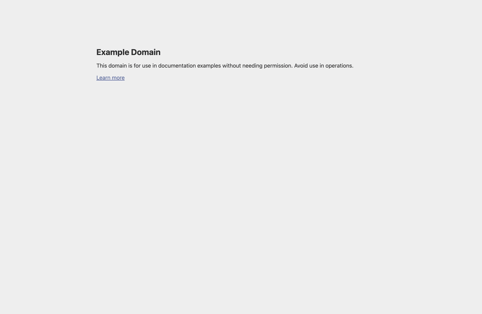

# Element Inspector

Inspect any element on a live webpage and bring its structure, styles, variables, and isolated preview into one focused workspace.



Element Inspector works in Chrome and Firefox. It includes:

- A visual element picker
- A movable and resizable in-page inspector
- A dedicated DevTools panel
- HTML, CSS, computed-style, CSS-variable, and DOM-tree views
- An isolated preview with CodePen export

## Install the extension

### Chrome

If you downloaded a release package:

1. Extract `dist-chrome.zip`.
2. Open `chrome://extensions`.
3. Enable **Developer mode**.
4. Select **Load unpacked**.
5. Choose the extracted extension directory containing `manifest.json`.

### Firefox

For temporary local installation:

1. Extract `dist-firefox.zip`.
2. Open `about:debugging#/runtime/this-firefox`.
3. Select **Load Temporary Add-on**.
4. Choose `manifest.json` from the extracted extension directory.

Firefox removes temporary add-ons when the browser closes.

After installing or updating Element Inspector, reload pages that were already open so the extension can initialize on them.

## Inspect an element

### From the browser toolbar

1. Open the webpage you want to inspect.
2. Select the **Element Inspector** extension icon.
3. Choose **Inspect Element**.
4. Move over the page to highlight an element.
5. Click the highlighted element.

Press `Escape` to cancel element picking.

### From DevTools

1. Open the browser’s developer tools.
2. Open the **Element Inspector** panel.
3. Select **Pick element**, then click an element on the page.

You can also select an element in the native Elements/Inspector panel and use **Inspect `$0`**. The custom inspector and native DevTools selection stay synchronized.

## The in-page inspector

The inspector can float over the page or dock to the left, right, or bottom. Drag a floating inspector to move it, or drag its edge or corner to resize it.

| Tab | What it shows |
| --- | --- |
| **Preview** | An isolated reproduction of the selected element |
| **Info** | Selector, DOM path, dimensions, text, and attributes |
| **Tree** | The element’s surrounding DOM structure |
| **HTML** | Formatted or raw `outerHTML` |
| **CSS** | Matching rules, layout context, assets, fonts, and animations |
| **Computed** | Final browser-calculated CSS properties |
| **Vars** | CSS custom properties available to the element |
| **JS** | Best-effort source clues when a reliable association can be found |

### Preview and export

Preview combines the selected HTML and extracted CSS in an isolated document. Use it to check whether the element can be reproduced away from its original page.

From Preview you can:

- Switch between rendered and source views
- Copy the preview source
- Download the preview
- Open the result in CodePen

### Understanding CSS results

The **CSS** tab focuses on where styles came from. It includes matching stylesheet rules and relevant layout context.

The **Computed** tab shows the final values after the cascade, inheritance, browser defaults, CSS variables, and overrides have been applied.

Use **Vars** to identify reusable design tokens such as colors, spacing, typography, and theme values.

## Suggested workflows

For page structure:

```text
Info → Tree → HTML
```

For appearance:

```text
CSS → Computed → Vars
```

For reproduction:

```text
Preview → Download or CodePen
```

## Troubleshooting

### The picker does not start

- Reload the webpage after installing or updating the extension.
- Make sure the current page is a normal website. Browsers restrict extensions on internal pages such as `chrome://`, `about:`, extension stores, and some PDF viewers.
- Confirm that Element Inspector is enabled in the browser’s extension manager.

### Styles or preview assets are missing

Cross-origin stylesheets, protected assets, authenticated requests, canvas rendering, shadow DOM, and runtime JavaScript can prevent a perfect standalone reproduction. The original page is not modified to bypass those restrictions.

## Permissions and privacy

Element Inspector needs access to webpages so it can inspect the element you select, read its styles and related resources, and communicate with its DevTools panel.

It also uses browser permissions for extension state, downloads, context-menu commands, and opening supported inspector actions. Inspection data stays in the extension workflow unless you explicitly download it or choose an external action such as **Open in CodePen**.

## Build from source

Requirements:

- A current Node.js release
- npm

Install dependencies:

```bash
npm install
```

Create a Chrome package:

```bash
npm run build:chrome
```

Create a Firefox package:

```bash
npm run build:firefox
```

The builds create `dist-chrome.zip` and `dist-firefox.zip`. The unpacked extension is written to `dist`.

Run type checking and linting without building:

```bash
npm run lint:types
```

Choose how to run the demo with the interactive picker:

```bash
./scripts/run-demo-interactive.sh
```

The launcher is standalone and does not read `package.json` or invoke npm.
`npm run demo` is also available as a convenience alias.

To regenerate the README demo directly:

```bash
npm run demo:gif
```

The picker can launch Chrome for manual inspection, run the automated smoke
test, or regenerate the README GIF. It requires `fzf` and can install it with
Homebrew when available. GIF generation also requires `ffmpeg`.
